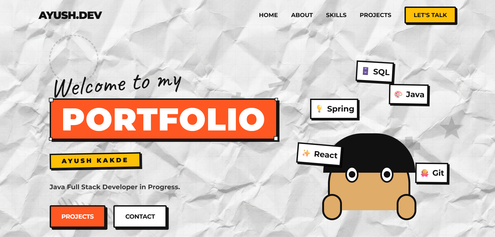
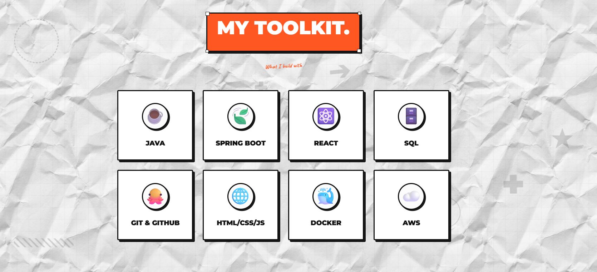
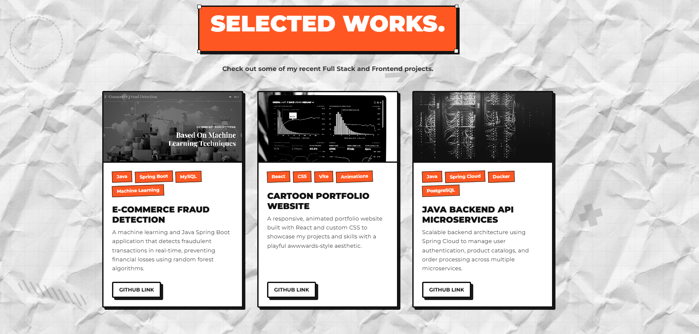
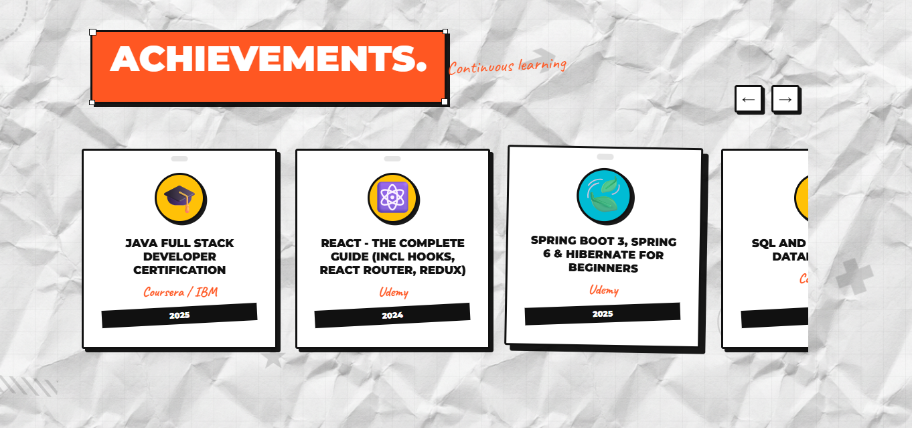
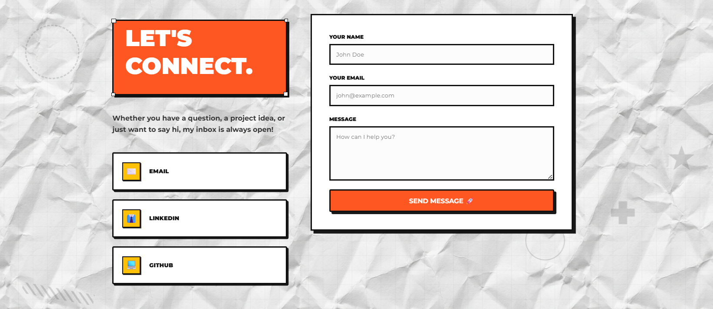

# 🎨 Ayush Kakde – Developer Portfolio

Welcome to my personal **Developer Portfolio Website** built using **React**.
This portfolio showcases my projects, skills, certifications, and provides a way for visitors to contact me directly.

---

# 🚀 Live Demo

🌐 **Portfolio Website**

```
ADD_YOUR_LIVE_WEBSITE_LINK_HERE
```

---

# 📸 Website Preview

### 🏠 Hero Section



---


### 🧰 Toolkit / Skills Section



---

### 💼 Projects Section



---

### 📜 Certificates Section



---

### 📩 Contact Section



---

# ✨ Features

* 🎯 Beautiful **Hero Section**
* 👨‍💻 **About Me Section**
* 🧰 **Toolkit / Skills Section**
* 💼 **Projects Showcase**
* 📜 **Certificates Section**
* 📩 **Contact Form using EmailJS**
* 🔗 **Footer with Social Links**
* 📱 Fully **Responsive Design**

---

# 🛠️ Tech Stack

### Frontend

* React
* JavaScript
* HTML5
* CSS3

### Tools & Libraries

* EmailJS
* Vite
* Git
* GitHub

---

# 📂 Project Structure

```
portfolio
│
├── public
│
├── src
│   ├── assets
│   ├── components
│   │   ├── Hero
│   │   ├── About
│   │   ├── Skills
│   │   ├── Projects
│   │   ├── Certificates
│   │   ├── Contact
│   │   └── Footer
│   │
│   ├── App.jsx
│   └── main.jsx
│
├── package.json
└── README.md
```

---

# ⚙️ Installation & Setup

Clone the repository

```
git clone https://github.com/Kakdeayush/MY_PORTFOLIO_AYUSHKAKDE
```

Navigate into the project folder

```
cd ADD_PROJECT_FOLDER_NAME
```

Install dependencies

```
npm install
```

Run the development server

```
npm run dev
```

Open in browser

```
http://localhost:5173
```

---

# 📧 Contact

If you want to collaborate or discuss opportunities, feel free to contact me.

📩 Email

```
kakdeayush376@gmail.com

```

---

# 🤝 Contributing

Contributions are welcome.

1. Fork the repository
2. Create a new branch
3. Make your changes
4. Submit a Pull Request

---

# ⭐ Support

If you like this project, consider giving it a **star ⭐ on GitHub**.

---

# 👨‍💻 Author

**Ayush Kakde**

Aspiring **Java Full Stack Developer**
